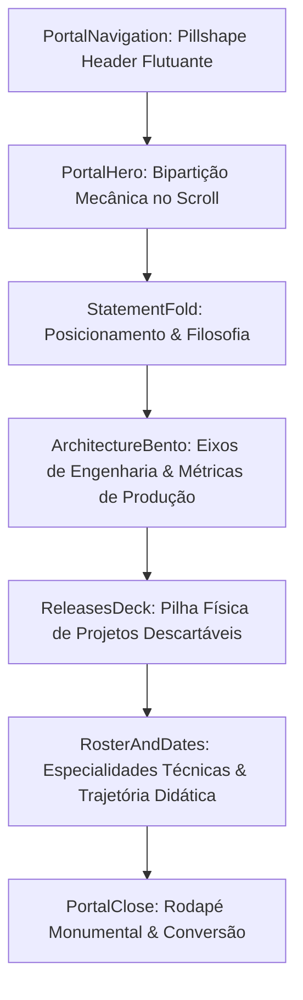

<!--
================================================================================
LOG DE MANUTENÇÃO DE DOCUMENTAÇÃO
--------------------------------------------------------------------------------
Data       | Autor          | Descrição
--------------------------------------------------------------------------------
2026-09-15 | Matheus Gruber | Criação da ADR 0001 documentando o redesign arquitetural
================================================================================
-->

# ADR 0001: Redesign da Arquitetura Visual e Estrutural do Portfólio (Paradigma Portal Record-Label)

## Status
**Implementada** (2026-09-15)

---

## Contexto

O portfólio anterior seguia uma estrutura convencional de landing page SaaS genérica (Hero padrão com gradientes, seções isoladas em blocos rígidos, formulário genérico de contato e lista estática de projetos). Esse formato não comunicava com a profundidade necessária a maturidade de engenharia de software de Matheus Gruber — especificamente sua atuação em **computação de baixo nível (AST, compiladores e VM)**, **arquitetura de sistemas resilientes corporativos** e **soluções com IA aplicada utilizando o protocolo MCP**.

### Riscos Identificados e Problemas a Resolver:
- **Percepção de Commodity:** Layouts padronizados colocavam o profissional na mesma vala comum de desenvolvedores júnior sem autoridade arquitetural.
- **Falta de Demonstração Prática:** Ausência de micro-interações que provassem domínio de animações físicas, gestão de estado e performance frontend (Core Web Vitals).
- **Sobrecarga de Ruído Visual:** Ausência de uma hierarquia cromática rigorosa (60/30/10).

---

## 1. Fundamentação & Princípios Técnicos

A nova interface foi concebida segundo os princípios do design editorial contemporâneo de selos de música e publicações de engenharia (*Dark Record-Label*), com conformidade estrita às diretrizes WCAG 2.2 AA para contraste e tipografia:
- **Regra 60/30/10:**
  - 60% Superfícies minerais escuras (`#0A0C0E` / `#101317`) e tipografia marfim (`#EDE7DC`).
  - 30% Acento primário estrutural em Teal (`#3FA2AD` / `#2E6B72`) para tags de engenharia, foco e metadados.
  - 10% Acento focal de impacto em Âmbar (`#E8913C`) para direcionamento visual e status ativos.
- **Anti-Slop:** Rejeição explícita a gradientes roxos padronizados e cartões estáticos sem física.

---

## 2. Decisão de Arquitetura

Substituir as seções legadas por um pipeline progressivo de 5 componentes mestres articulados no scroll:

### Componentes Chave Introduzidos:
1. **`PortalNavigation`**: Cabeçalho flutuante em pílula com blur, navegação PT-BR e ação direta sem quebras de linha.
2. **`PortalHero`**: Portal bipartido interativo com painéis mecânicos que se abrem horizontalmente com a rolagem (`framer-motion`) e wordmark responsiva contida.
3. **`StatementFold`**: Manifesto editorial conciso destacando a convergência entre baixo nível e IA aplicada.
4. **`ArchitectureBento`**: Bento Grid com spotlight radial interativo que segue o cursor, exibindo os 3 eixos de especialidade, métricas em produção e dualidade técnica/negócios.
5. **`ReleasesDeck`**: Pilha física tátil de cartas de engenharia com física de arraste/descarte, navegação por teclado e caixa explicativa de decisões arquiteturais.
6. **`RosterAndDates`**: Especialidades didáticas detalhadas e tabela cronológica de evolução profissional.
7. **`PortalClose`**: Rodapé com wordmark monumental adaptativa e call to action direto para WhatsApp e GitHub.

---

## 3. Matriz de Implementação Técnica (*IN-CODE*)

| Módulo / Camada | Arquivo Principal | Responsabilidade |
| :--- | :--- | :--- |
| **Design Tokens** | `DESIGN.md`, `src/app/globals.css` | Definição da paleta mineral e tokens CSS nativos. |
| **Navegação** | `src/components/PortalNavigation.tsx` | Barra de navegação flutuante com suporte a mobile drawer. |
| **Hero Interativo** | `src/components/PortalHero.tsx` | Animação bipartida orientada ao scroll com badge vivo. |
| **Bento Grid** | `src/components/ArchitectureBento.tsx` | Spotlight dinâmico com mouse tracking e dados de produção. |
| **Deck Físico** | `src/components/ReleasesDeck.tsx` | Pilha de cartas com transformações 3D e rotações dinâmicas. |
| **Carreira & Roster** | `src/components/RosterAndDates.tsx` | Mapeamento detalhado de competências e marcos históricos. |
| **Orquestração** | `src/app/page.tsx` | Renderização sequencial sem dependências legadas. |

---

## 4. Matriz de Ações de Governança (*OFF-CODE*)

- **Indexação LLM:** Atualizados os arquivos `public/llms.txt` e `public/llms-full.txt` com a nova biografia, stack técnica e contexto semântico.
- **Identidade Nominal:** Unificação do nome profissional para **Matheus Gruber** em todos os metadados OpenGraph, Twitter Cards e Schemas JSON-LD (`Person`, `WebSite`, `ProfilePage`).
- **Acessibilidade:** Inclusão de `suppressHydrationWarning` em `<html>` e `<body>` contra interferências de extensões do navegador.

---

## 5. Consequências e Resultados

### Positivas:
- **Diferenciação Estética Imediata:** A experiência visual é singular, fluida e passa credibilidade instantânea.
- **Transparência de Senioridade:** O visitante compreende o ecossistema mental completo do desenvolvedor (Low-Level + Web + IA).
- **Desempenho Estático Puro:** Tempo de compilação inferior a 5 segundos com exportação SSG pura (`output: "export"`).

### Mitigações e Desafios Gerenciados:
- **Redução de Movimento:** Os componentes verificam preferências do sistema (`prefers-reduced-motion`) para garantir conforto visual a usuários sensíveis.
- **Mobile First:** A pilha de cartas e o bento grid adaptam-se para layout vertical fluido em telas pequenas.
