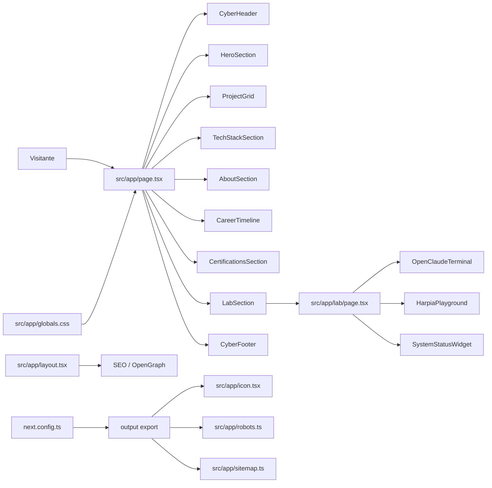

# 📝 Registro de Desenvolvimento — 2026-08-02

**Escopo:** Redesign profissional Technical Premium do monPortfolio
**Commits gerados:** 20
**Arquivos modificados:** 37

---

## 1. Visão Geral das Alterações

O portfolio foi reposicionado de uma vitrine técnica/cyberpunk para uma narrativa profissional de valor, destacando engenharia fullstack, UI/UX, arquitetura, IA aplicada e publicação ponta a ponta. A home agora conduz o visitante por posicionamento, cases, prova técnica, trajetória, credenciais, laboratório e contato. Também foram corrigidas informações profissionais sensíveis, removida autoria indevida do OpenClaude, substituído o case Lamed por monFinTrack e preparada a geração estática do Next.js.

---

## 2. Arquitetura Afetada

---

## 3. Mapa de Arquivos Modificados

| Arquivo | Tipo | O que mudou |
|--------|------|-------------|
| `.firebaserc` | Config | Configuração do projeto Firebase `monportfolio-dgruber`. |
| `.gitignore` | Config | Ignora `.superpowers/` e `.firebase/` como artefatos locais. |
| `.superpowers/**` | Workflow local | Removido do versionamento para não poluir o repositório. |
| `firebase.json` | Config | Configuração de deploy/hosting Firebase. |
| `next.config.ts` | Config | Ativa `output: "export"` e imagens não otimizadas para export estático. |
| `package.json` | Config | Ajustes relacionados ao setup do projeto e Firebase. |
| `package-lock.json` | Lockfile | Sincronização das dependências. |
| `src/app/globals.css` | Style | Tokens Technical Premium, helpers `premium-shell`, `premium-card`, orbs e motion-safe sheen. |
| `src/app/icon.tsx` | App Route | Ícone forçado como estático e sem runtime edge conflitante. |
| `src/app/lab/page.tsx` | Route | Nova rota para laboratório técnico. |
| `src/app/layout.tsx` | Metadata/Layout | SEO atualizado para fullstack, UI/UX, Angular, React e IA aplicada. |
| `src/app/page.tsx` | Route | Home reorganizada em narrativa profissional. |
| `src/app/robots.ts` | App Route | `robots.txt` forçado como estático. |
| `src/app/sitemap.ts` | App Route | `sitemap.xml` forçado como estático. |
| `src/components/AboutSection.tsx` | Component | Narrativa sobre atuação fullstack, UI/UX e arquitetura ponta a ponta. |
| `src/components/CareerTimeline.tsx` | Component | Corrige CPB sem “Pleno”, Angular no stack atual e IA como cursando. |
| `src/components/CertificationsSection.tsx` | Component | Corrige pós-graduação cursando e OpenClaude como adaptação/contribuição. |
| `src/components/CyberFooter.tsx` | Component | CTA final para contratação, produto, UI/UX e arquitetura. |
| `src/components/CyberHeader.tsx` | Component | Cabeçalho profissional com posicionamento fullstack/UI/UX. |
| `src/components/HeroSection.tsx` | Component | Hero fullstack com animações moderadas, proof points e fluxo de entrega. |
| `src/components/LabSection.tsx` | Component | Nova seção teaser do laboratório com painel técnico. |
| `src/components/OpenClaudeTerminal.tsx` | Component | Remove autoria indevida do OpenClaude. |
| `src/components/ProjectGrid.tsx` | Component | Substitui Lamed por monFinTrack e ajusta cases. |
| `src/components/SystemStatusWidget.tsx` | Component | Troca referência Lamed por monFinTrack. |
| `src/components/TechStackSection.tsx` | Component | Prova técnica por eixos: front-end/UI/UX, backend, arquitetura e IA. |
| `src/lib/firebase.ts` | Library | Integração com Firebase Web SDK. |

---

## 4. Detalhamento por Commit

### `docs(layout): atualiza metadata e layout base para refletir fullstack/UI/UX`

**Razão da alteração:**
> O SEO e a metadata ainda não refletiam o posicionamento profissional fullstack, UI/UX, Angular, React e IA aplicada.

**O que faz agora:**
> Atualiza título, descrição, keywords e OpenGraph para comunicar o valor profissional correto.

**Decisões técnicas:**
> Mantida a configuração de metadata nativa do Next App Router sem adicionar bibliotecas.

**Arquivos envolvidos:**
- `src/app/layout.tsx` — metadata e descrições profissionais.

### `refactor(home): reorganiza narrativa e move experimentos para rota /lab`

**Razão da alteração:**
> A home estava competindo entre demonstrações técnicas e mensagem profissional.

**O que faz agora:**
> A página inicial segue narrativa de valor; experimentos foram movidos para `/lab`.

**Decisões técnicas:**
> Reuso dos componentes existentes na rota de laboratório, evitando recriar os demos.

**Arquivos envolvidos:**
- `src/app/page.tsx` — nova ordem da home.
- `src/app/lab/page.tsx` — rota dedicada aos experimentos.

### `feat(globals): introduz base visual Technical Premium com tokens e helpers`

**Razão da alteração:**
> O visual precisava sair do cyberpunk/gamer para um dark premium profissional.

**O que faz agora:**
> Define tokens de cor, superfícies, cards premium, orbs e estados de motion seguros.

**Decisões técnicas:**
> Uma única cor de acento azul foi mantida para consistência visual.

**Arquivos envolvidos:**
- `src/app/globals.css` — base visual global.

### `feat(hero): reescreve posicionamento fullstack com animação moderada`

**Razão da alteração:**
> O hero precisava comunicar rapidamente a proposta de valor e preencher melhor a composição visual.

**O que faz agora:**
> Apresenta fullstack, UI/UX, arquitetura, IA aplicada e fluxo “do conceito ao deploy”.

**Decisões técnicas:**
> Animações moderadas com `framer-motion` já instalado, sem nova dependência.

**Arquivos envolvidos:**
- `src/components/HeroSection.tsx` — copy, cards, microinterações e animações.

### `feat(projects): substitui case Lamed por monFinTrack e ajusta narrativa`

**Razão da alteração:**
> O case Lamed deveria sair e monFinTrack representa melhor a atuação fullstack atual.

**O que faz agora:**
> Apresenta monFinTrack com Angular, FastAPI, Firebase, Gemini e atuação de arquitetura/UI/UX.

**Decisões técnicas:**
> O modelo de cards foi preservado, mudando conteúdo e ênfase.

**Arquivos envolvidos:**
- `src/components/ProjectGrid.tsx` — lista e descrição dos cases.

### `feat(tech-stack): prova técnica organizada por eixos com front-end/UI/UX à frente`

**Razão da alteração:**
> A prova técnica precisava deixar claro que a atuação não é apenas backend.

**O que faz agora:**
> Organiza competências em front-end/UI/UX, backend, arquitetura/integrações e IA aplicada.

**Decisões técnicas:**
> Conteúdo estruturado em dados locais simples, sem camada extra.

**Arquivos envolvidos:**
- `src/components/TechStackSection.tsx` — eixos técnicos e provas.

### `feat(about): reposiciona narrativa sobre fullstack e UI/UX`

**Razão da alteração:**
> A seção sobre precisava alinhar trajetória com entrega ponta a ponta.

**O que faz agora:**
> Destaca arquitetura, backend, front-end, UI/UX, integrações e publicação.

**Decisões técnicas:**
> Ajuste de copy e hierarquia sem abstrações novas.

**Arquivos envolvidos:**
- `src/components/AboutSection.tsx` — narrativa profissional.

### `feat(trajectory): ajusta trajetória com CPB atual, IA cursando e OpenClaude contribuição`

**Razão da alteração:**
> Havia informações incorretas: “Pleno”, Go no papel atual e pós-graduação concluída.

**O que faz agora:**
> Corrige CPB para Engenheiro de Software, troca Go por Angular e marca IA como cursando.

**Decisões técnicas:**
> A timeline continua baseada em dados locais no componente.

**Arquivos envolvidos:**
- `src/components/CareerTimeline.tsx` — cargos, períodos, descrições e skills.

### `feat(certifications): alinha credenciais com IA cursando e OpenClaude contribuição`

**Razão da alteração:**
> A seção de credenciais atribuía autoria indevida e status educacional incorreto.

**O que faz agora:**
> OpenClaude passa a ser adaptação/contribuição e IA aplicada fica como formação em andamento.

**Decisões técnicas:**
> Correção textual direta no componente, sem criar fonte externa de dados.

**Arquivos envolvidos:**
- `src/components/CertificationsSection.tsx` — credenciais e highlights.

### `feat(lab): adiciona seção de laboratório com painel técnico`

**Razão da alteração:**
> A seção Lab estava visualmente vazia e precisava apoiar a autoridade técnica sem roubar a home.

**O que faz agora:**
> Adiciona painel “lab stack”, sinais técnicos e microinterações.

**Decisões técnicas:**
> Mantém o laboratório como conteúdo secundário com CTA para `/lab`.

**Arquivos envolvidos:**
- `src/components/LabSection.tsx` — novo teaser de laboratório.

### `feat(header): reescreve cabeçalho com copy fullstack/UI/UX`

**Razão da alteração:**
> O header precisava reforçar o posicionamento logo no topo.

**O que faz agora:**
> Apresenta “Fullstack Engineer · UI/UX · IA Aplicada” e navegação profissional.

**Decisões técnicas:**
> Scroll state simples em client component, mantendo o comportamento existente.

**Arquivos envolvidos:**
- `src/components/CyberHeader.tsx` — copy e estrutura do cabeçalho.

### `feat(footer): reescreve CTA final para contratação, produto, UI/UX e arquitetura`

**Razão da alteração:**
> O rodapé precisava converter melhor para contato profissional.

**O que faz agora:**
> CTA orientado a contratação, produto, UI/UX, arquitetura fullstack e IA aplicada.

**Decisões técnicas:**
> Copy direta e botões já compatíveis com a base visual.

**Arquivos envolvidos:**
- `src/components/CyberFooter.tsx` — CTA final.

### `fix(openclaude): remove autoria indevida no terminal`

**Razão da alteração:**
> O portfolio não deve afirmar que o usuário criou o OpenClaude.

**O que faz agora:**
> Descreve corretamente adaptação e contribuição ao projeto.

**Decisões técnicas:**
> Alteração mínima no texto do terminal.

**Arquivos envolvidos:**
- `src/components/OpenClaudeTerminal.tsx` — copy do terminal.

### `fix(system-status): troca referência Lamed por monFinTrack`

**Razão da alteração:**
> Lamed foi removido da narrativa principal.

**O que faz agora:**
> O status técnico cita monFinTrack como API financeira.

**Decisões técnicas:**
> Alteração mínima em dado local.

**Arquivos envolvidos:**
- `src/components/SystemStatusWidget.tsx` — item de serviço.

### `chore(gitignore): ignora artefatos locais de fluxo de trabalho`

**Razão da alteração:**
> Arquivos `.superpowers/` são scratch local e não devem entrar no repositório.

**O que faz agora:**
> Adiciona `.superpowers/` ao `.gitignore`.

**Decisões técnicas:**
> Mantém o histórico de trabalho fora do código versionado.

**Arquivos envolvidos:**
- `.gitignore` — regra para artefatos locais.

### `feat(static-export): configura geração estática do portfolio`

**Razão da alteração:**
> O portfolio precisa ser compatível com exportação estática.

**O que faz agora:**
> Configura `output: "export"`, imagens não otimizadas e força icon/robots/sitemap como estáticos.

**Decisões técnicas:**
> Removido `runtime = 'edge'` do icon porque ele conflita com `dynamic = 'force-static'`.

**Arquivos envolvidos:**
- `next.config.ts` — export estático.
- `src/app/icon.tsx` — ícone estático sem edge runtime.
- `src/app/robots.ts` — robots estático.
- `src/app/sitemap.ts` — sitemap estático.

### `chore(gitignore): ignora cache local do Firebase`

**Razão da alteração:**
> `.firebase/` contém cache local de deploy e não deve ser versionado.

**O que faz agora:**
> Adiciona `.firebase` ao `.gitignore`.

**Decisões técnicas:**
> Mantém configuração de deploy versionável e cache fora do repositório.

**Arquivos envolvidos:**
- `.gitignore` — regra para cache local Firebase.

### `chore(repo): remove artefatos superpowers do versionamento`

**Razão da alteração:**
> Arquivos de brainstorming/SDD tinham sido rastreados e poluíam o histórico.

**O que faz agora:**
> Remove os artefatos `.superpowers/` do índice, mantendo-os locais e ignorados.

**Decisões técnicas:**
> Foi usado `git rm --cached`, preservando os arquivos no disco.

**Arquivos envolvidos:**
- `.superpowers/**` — removidos do versionamento.

### `feat: setup Firebase project monportfolio-dgruber & Web SDK integration`

**Razão da alteração:**
> O projeto precisava de configuração base para integração/deploy Firebase.

**O que faz agora:**
> Adiciona configuração Firebase, dependências e biblioteca local de inicialização.

**Decisões técnicas:**
> Setup mantido separado do redesign visual.

**Arquivos envolvidos:**
- `.firebaserc` — projeto Firebase.
- `firebase.json` — configuração Firebase.
- `package.json` — dependências/scripts relacionados.
- `package-lock.json` — lockfile.
- `src/lib/firebase.ts` — inicialização Firebase.

### `docs(commits): registra redesign profissional do monPortfolio`

**Razão da alteração:**
> O fluxo solicitado exige documentação técnica consolidada após os commits atômicos.

**O que faz agora:**
> Registra visão geral, arquitetura afetada, mapa de arquivos, detalhamento por commit, validações, dívidas e próximos passos.

**Decisões técnicas:**
> Documento único em Markdown com Mermaid para facilitar revisão humana e histórico técnico.

**Arquivos envolvidos:**
- `docs/commits/2026-08-02_monportfolio-redesign.md` — registro técnico da sessão.

---

## 5. ✅ O Que Está Funcionando

- Home com narrativa profissional: posicionamento → cases → prova técnica → credenciais → lab → contato.
- Copy alinhada com atuação fullstack, front-end, UI/UX, arquitetura e publicação.
- Case monFinTrack substituindo Lamed.
- OpenClaude descrito como adaptação/contribuição, não autoria.
- Pós-graduação em Engenharia de IA Aplicada marcada como cursando.
- CPB atual sem “Pleno” e com Angular no stack.
- Hero e Lab com composição visual mais preenchida e animações moderadas.
- Export estático do Next.js configurado.
- `/`, `/lab`, `/icon`, `/robots.txt` e `/sitemap.xml` prerenderizados como estáticos.
- Build final executado com sucesso via `npm run build`.

---

## 6. ❌ O Que Está Pendente

- [ ] Revisão manual final no navegador — necessária para validar percepção visual, espaçamento e responsividade real.
- [ ] Deploy final — depende de executar o fluxo de publicação escolhido fora desta documentação.
- [ ] Configurar lint não-interativo — `next lint` não foi usado porque abre prompt de setup no projeto atual.

---

## 7. ⚠️ Dívida Técnica Identificada

- Alguns componentes ainda mantêm nomes legados `Cyber*`, embora a estética atual seja Technical Premium.
- `npm run lint` precisa ser substituído/configurado para um comando não-interativo de validação.
- Vários textos dos cases e seções vivem dentro dos próprios componentes; se crescerem, pode valer extrair para um arquivo de conteúdo tipado.
- O histórico já recebeu limpeza dos artefatos `.superpowers/`, mas os arquivos seguem locais e ignorados, como esperado.

---

## 8. Padrões Importantes a Lembrar

- Manter uma única cor dominante de acento: azul.
- Não voltar para estética cyberpunk/gamer, gradiente roxo genérico ou “AI slop”.
- Comunicar Matheus como fullstack, UI/UX, arquitetura e IA aplicada.
- Não afirmar autoria do OpenClaude; usar adaptação/contribuição.
- Tratar laboratório técnico como prova secundária, não protagonista da home.
- Para export estático, manter `output: "export"`, `images.unoptimized = true` e rotas metadata como estáticas.

---

## 9. Próximos Passos

1. Rodar revisão visual manual em desktop e mobile.
2. Ajustar eventuais quebras finas de responsividade após a revisão visual.
3. Configurar lint/check não-interativo para CI ou workflow local.
4. Executar deploy estático no destino escolhido.
5. Considerar renomear componentes `Cyber*` em uma refatoração futura, se a nomenclatura começar a confundir manutenção.

---

## 10. Validações Mapeadas

| Campo / Função | Regra de validação | Status |
|---------------|-------------------|--------|
| `npm run build` | Build Next.js deve compilar, checar tipos, gerar páginas estáticas e exportar sem warning de runtime edge. | ✅ |
| `src/app/icon.tsx` | Não deve combinar `runtime = 'edge'` com `dynamic = 'force-static'`. | ✅ |
| `next.config.ts` | Deve usar `output: "export"` para build estático. | ✅ |
| `src/app/page.tsx` | Home deve priorizar narrativa profissional e mover demos para `/lab`. | ✅ |
| `src/components/ProjectGrid.tsx` | Deve usar monFinTrack no lugar de Lamed. | ✅ |
| `src/components/OpenClaudeTerminal.tsx` | Não deve afirmar autoria do OpenClaude. | ✅ |
| `src/components/CareerTimeline.tsx` | CPB atual sem “Pleno”, com Angular e IA cursando. | ✅ |
| `.gitignore` | Deve ignorar `.superpowers/` e `.firebase/`. | ✅ |
| Revisão visual em navegador | Validar percepção final em tamanhos reais de tela. | ❌ |
| Lint não-interativo | Deve existir comando de lint/check sem prompt. | ❌ |
