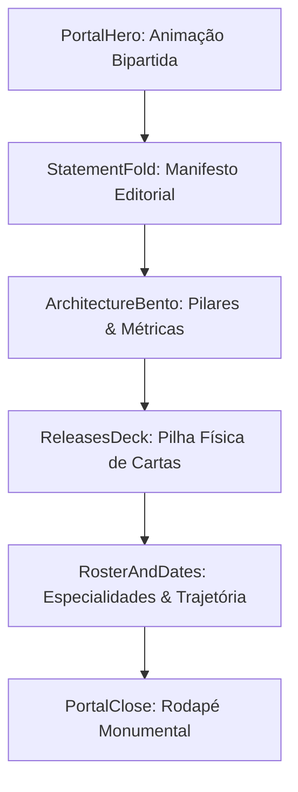

<!--
================================================================================
LOG DE MANUTENÇÃO DE DOCUMENTAÇÃO
--------------------------------------------------------------------------------
Data       | Autor          | Descrição
--------------------------------------------------------------------------------
2026-09-15 | Matheus Gruber | Registro consolidado de desenvolvimento da sessão de redesign.
================================================================================
-->

# Registro de Desenvolvimento — 2026-09-15

| Metadado | Detalhe |
| :--- | :--- |
| **Escopo Principal** | Redesign Arquitetural do Portfólio (Paradigma Portal Record-Label) |
| **Commits Gerados** | Micro-commits semânticos atômicos |
| **Arquivos Modificados** | Componentes de UI, estilos globais, metadados SEO, agentes e documentação |
| **ADRs Vinculadas / Geradas** | `docs/adr/0001-redesign-arquitetura-portal-record-label.md` |

---

## 1. Visão Geral das Alterações

Nesta sessão de desenvolvimento, transformamos integralmente o portfólio pessoal de Matheus Gruber, elevando a identidade visual e arquitetural de uma landing page genérica para um ecossistema estético inspirado no design editorial de selos de música (*Dark Record-Label*). 

A interface incorpora animação bipartida mecânica orientada a scroll no Hero, Bento Grid dinâmico com spotlight que reage ao cursor, uma pilha física descartável de cases de engenharia, detalhamento didático de especialidades e marcos cronológicos em PT-BR, com aplicação rigorosa da regra de harmonia cromática 60/30/10 e exportação estática Next.js de alta performance.

---

## 2. Arquitetura Afetada & Decisões (ADRs)

- **Decisões Registradas:**
  - `docs/adr/0001-redesign-arquitetura-portal-record-label.md`: Adoção do paradigma de portal mecânico e componentes dinâmicos orientados à física e scroll.

---

## 3. Mapa de Arquivos Modificados

| Arquivo | Camada Técnica | Resumo da Modificação |
| :--- | :--- | :--- |
| `DESIGN.md` | Governança de Design | Especificação de tokens, tipografia e regra 60/30/10 |
| `docs/adr/0001-redesign-arquitetura-portal-record-label.md` | Governança | ADR canônica registrando a decisão arquitetural do redesign |
| `src/app/globals.css` | Estilos Globais | Definição das variáveis de paleta mineral e foco acessível |
| `src/app/layout.tsx` | Infraestrutura / Shell | Inclusão de fontes Syne/Sora, Schema.org e `suppressHydrationWarning` |
| `src/app/page.tsx` | Orquestração | Montagem limpa e sequencial dos novos componentes |
| `src/components/PortalNavigation.tsx` | Apresentação / UI | Header flutuante em pílula com suporte a mobile drawer |
| `src/components/PortalHero.tsx` | Apresentação / UI | Hero bipartido mecânico com badge vivo de disponibilidade |
| `src/components/StatementFold.tsx` | Apresentação / UI | Manifesto editorial balanceado entre baixo nível e IA |
| `src/components/ArchitectureBento.tsx` | Apresentação / UI | Bento grid com spotlight do cursor e métricas de produção |
| `src/components/ReleasesDeck.tsx` | Apresentação / UI | Pilha tátil de projetos com física de descarte e caixa de impacto |
| `src/components/RosterAndDates.tsx` | Apresentação / UI | Trajetória e especialidades 100% didáticas em PT-BR |
| `src/components/PortalClose.tsx` | Apresentação / UI | Encerramento monumental com wordmark adaptativa |
| `public/llms.txt` & `llms-full.txt` | IA / Indexação | Atualização do contexto semântico com nova bio e stack |
